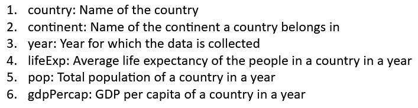

# Fundamentals of R, data visualization, basic data wrangling, and exploration. 

<b> About the data set: </b>  
The data set used in this assignment is <i><b> Gapminder </b></i> dataset, which is available as a library in R.  

Data Dictionary:  

<b> Steps in the notebook:</b>  

    1. Data Exploration
    2) Data Visualization
    
  The code can be found in the pdf doc named <i> <b> Assignment_1_report </b> </i>
