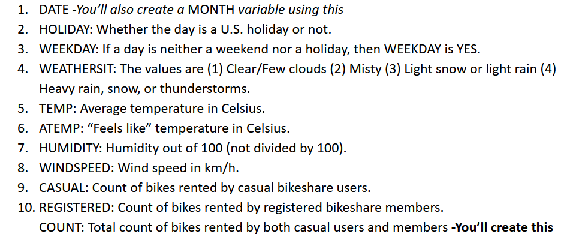
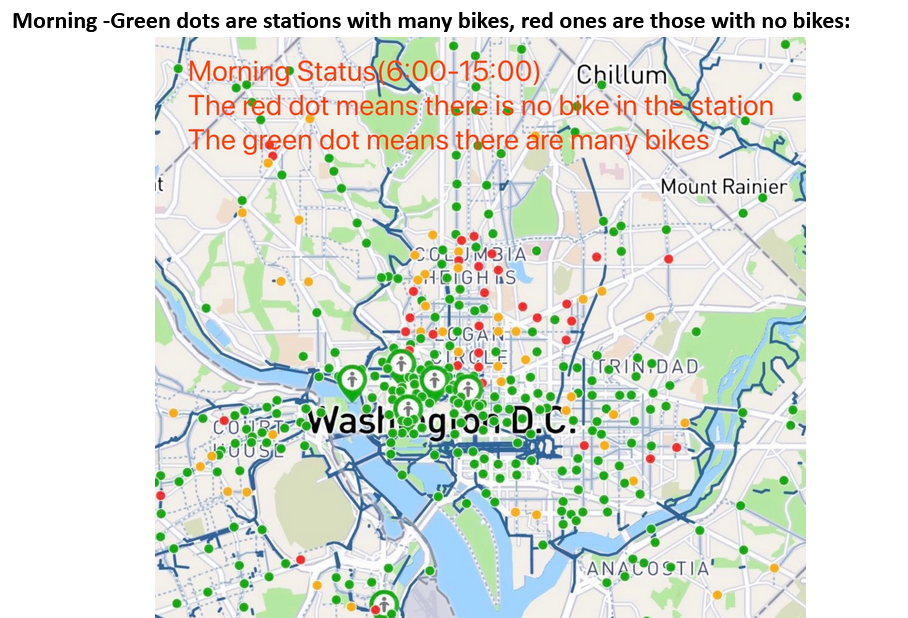
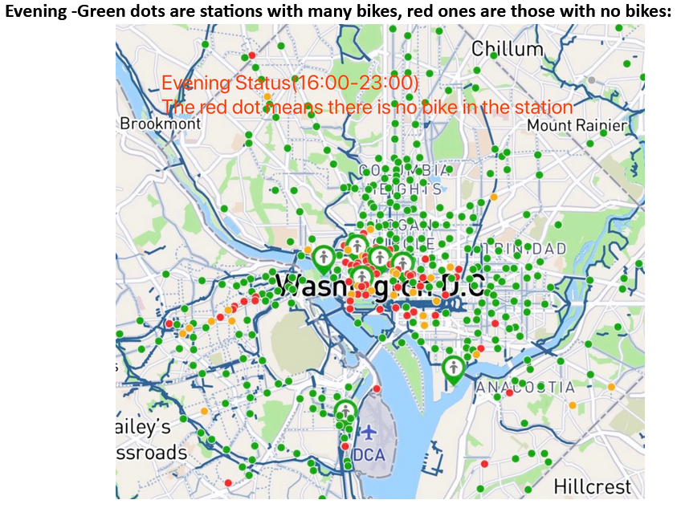

# Predict total count of bikes rented by both casual users and members of Capital Bikeshare using predictive analysis

<b> About the project: </b>

    Capital Bikeshare has about 30K members, and served about 23.6 million trips through its 550 stations. 
    The Bikeshare data has been combined with weather data to gather better insights for prediction.
    
    There are two main objectives. 
      First, to predict the variable COUNT as a function of the other variables. 
      Second, to build alternative models, and measure and improve the performance.
  
<b> About the data set: </b>  
The data set used in this assignment is <i><b> bikeShare.csv </b></i> from DC’s <b> Capital Bikeshare </b> (also serves Maryland and Virginia).  
Data Dictionary:
 

<b> Libraries to download: </b>  

    tidyverse
    tidymodels
    plotly
    skimr
    caret

<b> Steps in the notebook:</b>  

    1. Data Preparation
        - Creating new variables
        - Standardizing variables
    2) Exploratory analysis 
    3) Run a Linear Regression model for COUNT using MONTH, WEEKDAY, BADWEATHER, TEMP, ATEMP, and HUMIDITY and regression diagnostics
    4) Run a linear regression to determine the effect of bad weather on COUNT
    5) Run a linear regression to determine the effect of bad weather and week day (Interaction Variable) on COUNT
    6) Split dataset into training and test set (80% and 20% respectively) and perform predictive analysis
    7) Perform time series analysis on training and test data.
 
 <b> Business Questions to answer </b>  
 
    1) What are some actions you would take if you were managing Capital Bikeshare’s pricing and promotions?
    2) Capital Bikeshare (like most other shared services) has an inherent challenge. In the morning, people use bikes to commute to their workplaces, 
    leaving the bike racks empty in residential areas (this is called rush-hour surge). In the evening, the same phenomenon repeats in the 
    opposite direction. Shared-service companies attempt to resolve this problem by rebalancing, which is basically moving bikes manually 
    during the off-peak hours using trucks (which you may have seen on the streets) and other means. What is a data-driven solution you would pursue?
  
  
 
  The code can be found in the pdf doc named <i> <b> Assignment_2_report </b> </i>
