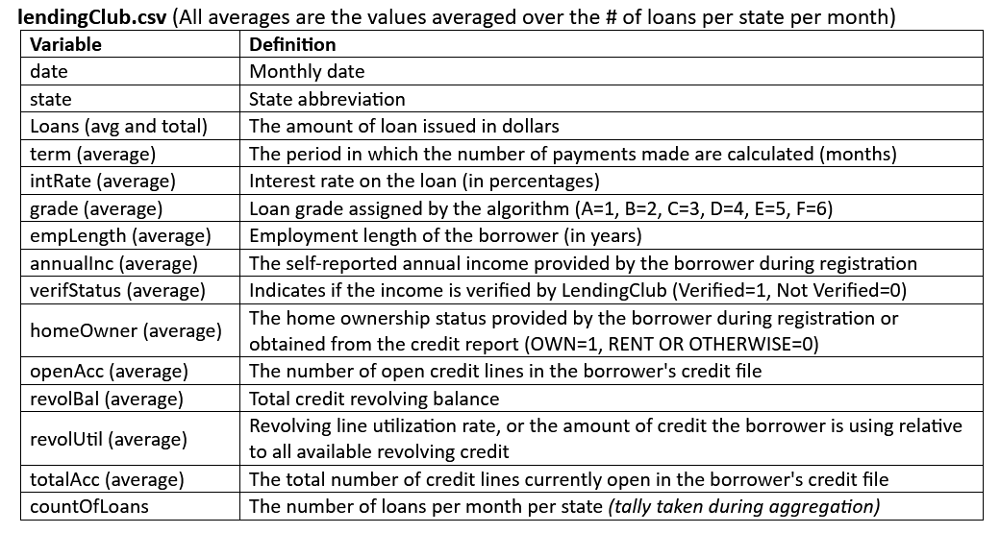
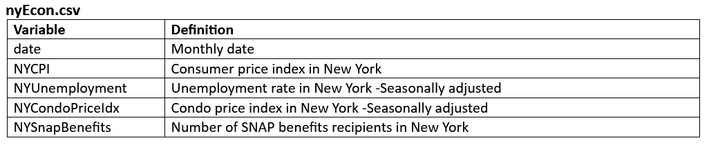
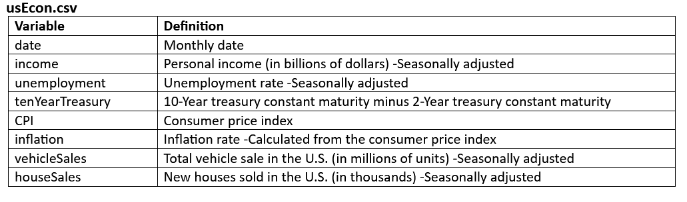

# Predicting/forecasting the LendingClub loans using Time Series Analysis

<b> About the project: </b>

    The main objective of this assignment is visualizing data and developing statistical models to help LendingClub 
    management understand better the changes in the characteristics of loans issued in NY over time. Models are 
    developed for determining the total dollar value of loans per capita, to guide LendingClub in its attempts 
    to increase its market share in NY.

<b> What are peer-to-peer (P2P) lending platforms?  </b>    
In peer-to-peer (P2P) lending platforms, consumers borrow from other consumers. The typical process is as follows:  
  
    Consumers who are in need of borrowing money make a request by entering their personal information, including the SSN number, 
    and the amount of money requested. If a request passes the initial checks, LendingClub’s algorithm assigns a grade to the request,
    which translates into an interest rate (the higher the grade, the lower the interest rate). Other consumers who would like to invest 
    into personal loans lend the money. 
    For the most part, the lending   
    is automated, so the P2P lending model is different from crowdfunding models. 
  
<b> About the data set: </b>  
The data sets used in this assignment are <i><b> lendingClub.csv </b></i> and <i><b> nyEcon.csv </b></i>  

<i><b> lendingClub.csv </b></i> contains data for all the loans issued from June 2007 to March 2017. The data is aggregated to the state-month level.  
<i><b> nyEcon.csv </b></i> includes some economic indicators for NY for the same timeframe (from June, 2007 to March, 2017).  
<i><b> US population </b></i> for each state from the 2010 Census is loaded from the U.S. Census Bureau’s data portal

Data Dictionary:
 
 
 

<b> Libraries to download: </b>  

    tidyverse
    fpp3
    tidymodels
    plotly
    skimr
    caret
    lubridate

<b> Steps in the notebook:</b>  

    1. Data Processing
        - Converting dataset to a tsibble
        - Joining datasets
    2) Exploratory analysis 
    3) Modeling the loans issued in NY using a Seasonal Naive and Drift forecast for NY data five years into the future
    4) Build a time series regression using both the time trend and seasons, as well as other variables that can be 
    use to explain the loan issued per capita.
    5) Build an ARIMA model and using a grid search. Check the differencing suggested by the KPSS test
    6) Split dataset into training and test set and perform predictive modelling. Compare model performance using RMSE
      i)   Time series regression with only trend and season
      ii)  Time series regression with trend, season and other variables
      iii) ARIMA grid search model without any other variables
      iv)  ARIMA grid search model with other variables

  The code can be found in the pdf doc named <i> <b> Assignment_4_report </b> </i>
