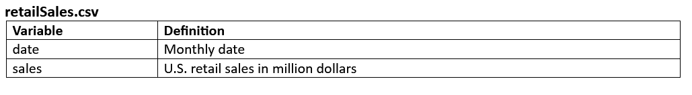

# Predicting/forecasting the U.S. retail sales

<b> About the data set: </b>  

<i><b> retailSales.csv </b></i> includes U.S. retail sales from January, 1992 to February, 2020.  
Data Dictionary:
 
<b> Libraries to download: </b>  

    tidyverse
    fpp3
    tidymodels
    plotly
    skimr
    caret
    lubridate
    
<b> Steps in the notebook:</b>  

    1) Data Preparation and exploration
    2) Create a seasonal, and a seasonal subseries plot for the subset data starting from 2015
    3) Create an STL decomposition plot (i) for the full data, and (ii) for a subset of the data
    between 2005 and 2015 (both bounds are inclusive)
    4) Create an autocorrelation function plot and a partial autocorrelation function plot
    5) Plot the seasonally adjusted sales superimposed on the actual sales data
    6) Create a second order moving average smoothing and plot the smoothed values on the actual sales data
    7) Modeling and analysis of time series
      i)   Build a time series regression using the time trend and seasons
      ii)  Build an ARIMA model
      iii) Split the dataset into training and test set and compare the ten-year forecasting performance 
      of a time series regression with trend and season, and an ARIMA model that uses a grid search
      iv)  Test and compare the five-year forecasting performance of a time series regression with 
      trend and season, and an ARIMA model that uses a grid search
      v)   Run the anomaly detection algorithm GESD following the STL decomposition
      
The code can be found in the pdf doc named <i> <b> Assignment_4_report </b> </i>
