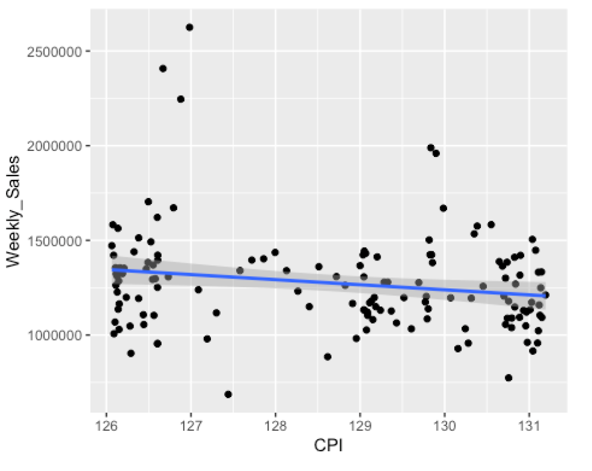

This lab discusses key operations in R for uploading datasets, practice with tidyverse functions for data wrangling, and data visualizations.
The following packages need to be installed for this lab.

    tidyverse
    tidymodels
    lubridate
    plotly
    skimr
    car
    
The walmartSales.csv data set is used in this lab. It provides weekly historical sales revenue for 45 Walmart stores (real data).  
Some of the taks performed in this lab:

    1) Data Exploration
    2) Creation and interpretation of several Regression models for explaining Weekly Sales
    3) Using test and Validation datasets to determine best model fit
    
Data Exploration example:  
Relationship between Cost per Index and the weekly sales for stores in differnt regions    
 

